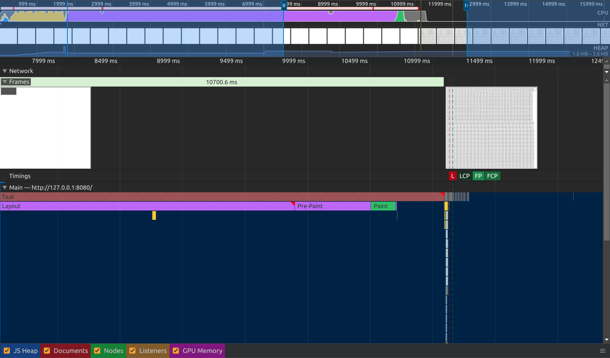
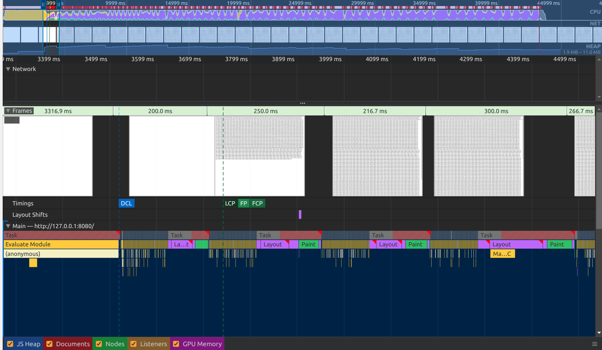

# Scheduler playground

Following the [optimize long tasks](https://web.dev/articles/optimize-long-tasks) article, here's a playground to try the browser's native scheduling API.


This example renders a list of 100,000 div elements and x4 CPU throttling.

```js
for (let i = 0; i < 100_000; i++) {
  // with scheduling
  scheduler.postTask(() => render(i))

  // without scheduling
  // render(i)
}

function render(i) {
  const item = document.createElement('div')
  item.innerText = `Item ${i}`
  item.style.display = 'inline-block'
  document.body.appendChild(item)
}
```

## Results

### without scheduling

Results in a single huge 8.35s user-blocking task (FCP 11.16s).

[base-profile.json](base-profile.json)



### with scheduling using `scheduler.postTask(render)`

Results in many non-blocking tasks (FCP 3.74s).

[post-task-profile.json](post-task-profile.json)



